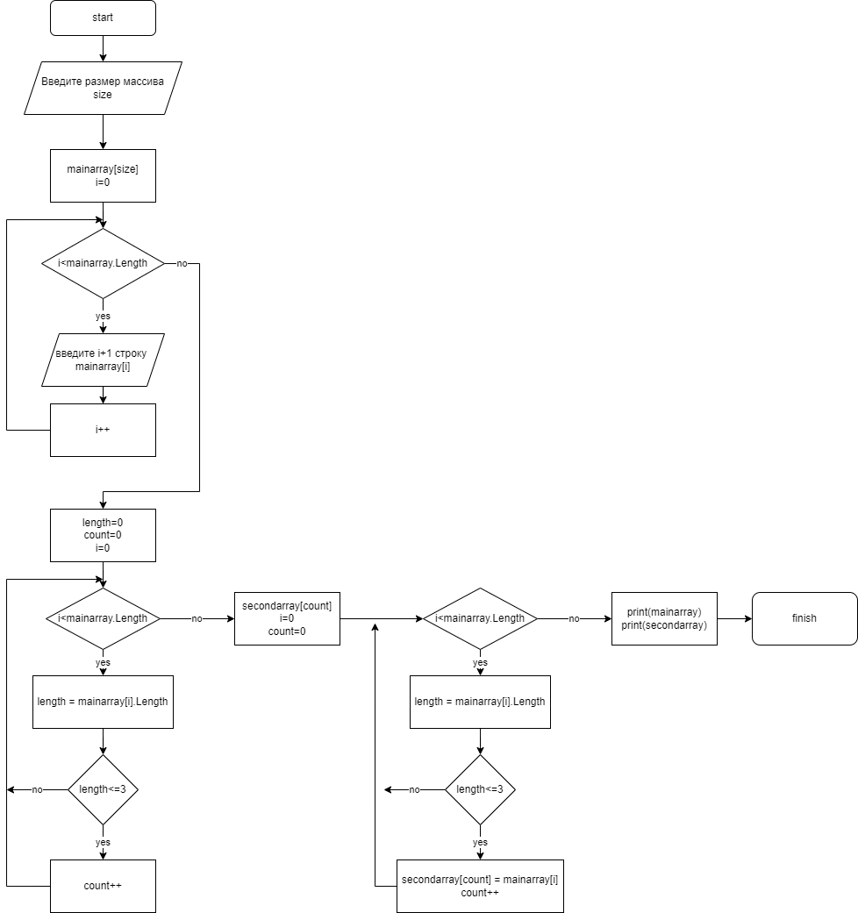

>>Задача: Написать программу, которая из имеющегося массива строк формирует массив из строк,
>>длина которых меньше либо равна 3 символам. Первоночальный массив можно ввести с клавиатуры, 
>>либо задать на старте выполнения алгоритма. При решении не рекомендуется пользоваться
>>колекциями, лучше обойтись исключительно массивами.

**Здесь представлена программа контрольной работы которая ищет в массиве строк строки длина которых <= 3 и создает новый массив из этих строк**
 Блок схема:
 

